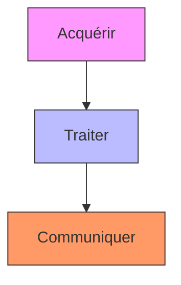
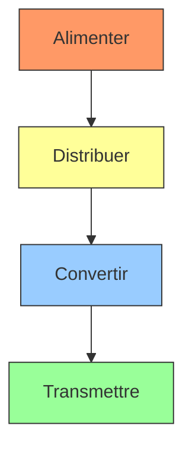
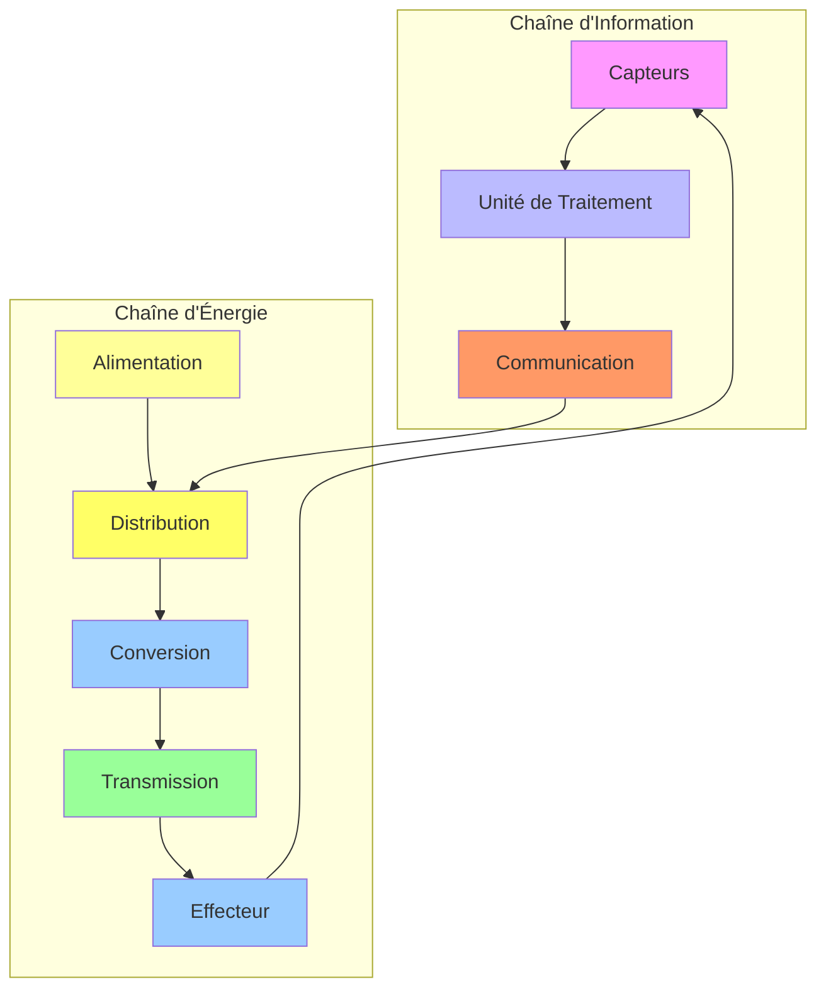

# Les Chaînes Fonctionnelles en Automatisme

> **Source** : [Techno-Logique](https://www.techno-logique.com/AUT-chaines-fonctionnelles.shtml)
> **Auteur** : Adapté pour une utilisation pédagogique.
> **Dernière mise à jour** : 2026

---

## 📌 **Table des Matières**
1. [Introduction](#-introduction)
2. [La Chaîne d'Information](#-1-la-chaîne-dinformation)
   - [Présentation](#présentation)
   - [Schéma Fonctionnel](#schéma-fonctionnel)
   - [Solutions Technologiques](#solutions-technologiques)
   - [Exemple : Régulation de Température](#exemple--régulation-de-température)
3. [La Chaîne d'Énergie](#-2-la-chaîne-dénergie)
   - [Présentation](#présentation-1)
   - [Schéma Fonctionnel](#schéma-fonctionnel-1)
   - [Solutions Technologiques](#solutions-technologiques-1)
   - [Exemple : Store Automatique](#exemple--store-automatique)
4. [Interactions entre les Chaînes](#-3-interactions-entre-les-chaînes)
5. [Schéma Global](#-schéma-global)
6. [Ressources Complémentaires](#-ressources-complémentaires)

---

## 🔹 **Introduction**
Les systèmes automatisés sont omniprésents dans notre quotidien :
- **Exemples** : Chauffage automatique, stores motorisés, alarmes, éclairage intelligent, etc.
- **Objectif** : Comprendre comment ces systèmes **acquièrent des informations**, **prennent des décisions** et **agissent** sur leur environnement.

Un système automatique repose sur **deux chaînes fonctionnelles** :
1. **La chaîne d'information** : Gère les **données** (capteurs, traitement, ordres).
2. **La chaîne d'énergie** : Gère les **actions** (alimentation, conversion, transmission).

---

---

## 🔹 **1. La Chaîne d'Information**

### **Présentation**
Un système automatique doit **acquérir, traiter et communiquer** des informations pour produire des **ordres**.
- **États** : Grandeurs physiques détectées (ex. température, présence, lumière).
- **Consignes** : Valeurs souhaitées par l'utilisateur (ex. température idéale = 20°C).
- **Capteurs** : Dispositifs qui mesurent les grandeurs physiques (ex. thermostat, cellule photoélectrique, détecteur de mouvement).

> **Définition** :
> La **chaîne d'information** est l'ensemble des **fonctions techniques** et **solutions technologiques** qui participent à la **prise de décision** par le système automatique.

---

### **📌 Schéma Fonctionnel**

#### **Fonctions Techniques**
La chaîne d'information est composée de **3 blocs fonctionnels** :



| Fonction       | Description                                                                 | Exemples de Solutions Technologiques                          |
|----------------|-----------------------------------------------------------------------------|---------------------------------------------------------------|
| **Acquérir**   | Traduire les grandeurs physiques en signaux électriques (via capteurs). | Capteur logique, analogique, numérique (bouton, thermistance, anémomètre). |
| **Traiter**    | Analyser les informations et prendre des décisions (via unité de commande). | Microprocesseur, automate programmable, circuit intégré.   |
| **Communiquer**| Envoyer les ordres à la chaîne d'énergie et des signaux à l'opérateur.     | Carte électronique, fibre optique, liaison sans fil, réseau. |

---

### **🔍 Solutions Technologiques**

#### **1. Acquérir**
Les capteurs transforment une **grandeur physique** en un **signal exploitable** (électrique, numérique, etc.).

| Type de Capteur       | Exemples                                                                 | Utilisation Typique                          |
|-----------------------|--------------------------------------------------------------------------|---------------------------------------------|
| **Logique**           | Interrupteur, bouton-poussoir, détecteur de présence.                  | Détection d'un état binaire (ouvert/fermé). |
| **Analogique**        | Thermistance, potentiomètre, anémomètre.                                | Mesure de valeurs continues (température, vitesse). |
| **Numérique**         | Cellule photoélectrique, capteur ultrasonique, capteur de CO₂.         | Détection précise avec traitement numérique. |

#### **2. Traiter**
L'unité de traitement analyse les données et génère des **ordres**.

| Solution Technologique       | Description                                                                 | Exemple d'Application                       |
|-------------------------------|-----------------------------------------------------------------------------|---------------------------------------------|
| **Circuit intégré**           | Composant électronique dédié à une tâche spécifique.                     | Régulation de température simple.          |
| **Microprocesseur**           | Unité centrale de traitement (CPU) pour des calculs complexes.           | Automate industriel.                        |
| **Microcontrôleur**           | Microprocesseur + mémoire + périphériques intégrés.                     | Arduino, Raspberry Pi.                      |
| **Automate programmable**     | Appareil dédié à l'automatisation industrielle (PLC).                     | Contrôle de chaînes de production.          |

#### **3. Communiquer**
Transmission des ordres et des informations.

| Solution Technologique       | Description                                                                 | Exemple                                      |
|-------------------------------|-----------------------------------------------------------------------------|---------------------------------------------|
| **Fils électriques**          | Transmission par câbles (signaux analogiques ou numériques).            | Câblage d'une alarme.                       |
| **Fibre optique**             | Transmission haut débit et immunisée aux interférences.                 | Réseaux industriels.                        |
| **Liaison sans fil**          | Wi-Fi, Bluetooth, radiofréquence.                                           | Domotique (ex. stores connectés).           |
| **Réseau**                    | Ethernet, CAN bus, Modbus.                                                  | Communication entre machines industrielles. |

---

### **🎯 Exemple : Régulation de Température**

**Contexte** : Un système de chauffage domestique intelligent.

```mermaid
graph LR
    A[Température souhaitée
    (Consigne : 20°C)] --> B[Thermostat
    (Capteur)]
    B --> C[Circuit intégré
    (Traitement)]
    C --> D[Carte électronique
    (Communication)]
    D --> E[Chaudière
    (Actionneur)]
    E --> F[Radiateurs
    (Effecteur)]
    F --> G[Température réelle
    (État)]
    G --> B
    
    style A fill:#9f9
    style B fill:#f9f
    style C fill:#bbf
    style D fill:#f96
    style E fill:#ff9
    style F fill:#9cf
    style G fill:#9f9
```

| Étape               | Composant          | Rôle                                                                 |
|---------------------|--------------------|----------------------------------------------------------------------|
| **Grandeurs**       | Thermostat         | Mesure la température réelle et compare à la consigne (20°C).      |
| **Acquérir**        | Thermostat         | Capteur qui détecte la température ambiante.                        |
| **Traiter**         | Circuit intégré    | Compare la température mesurée à la consigne.                      |
| **Communiquer**     | Carte électronique | Envoie l'ordre "allumer" ou "éteindre" à la chaudière.               |
| **Ordres**          | Chaudière          | Allume ou éteint le chauffage en fonction de l'ordre reçu.           |

---

---

## 🔹 **2. La Chaîne d'Énergie**

### **Présentation**
Un système automatique a besoin d'une **source d'énergie** pour effectuer des **actions**.
- **Énergies variées** : Électrique, mécanique, thermique, hydraulique, pneumatique.
- **Rôle des ordres** : Provenant de la chaîne d'information, ils autorisent :
  - La **distribution** de la bonne quantité d'énergie.
  - La **conversion** de l'énergie (via actionneurs).
  - La **transmission** de l'énergie aux effecteurs.

> **Définition** :
> La **chaîne d'énergie** est l'ensemble des **fonctions techniques** et **solutions technologiques** qui participent à la **réalisation des opérations** par le système automatique.

---

### **📌 Schéma Fonctionnel**

La chaîne d'énergie est composée de **4 blocs fonctionnels** :



| Fonction       | Description                                                                 | Exemples de Solutions Technologiques                          |
|----------------|-----------------------------------------------------------------------------|---------------------------------------------------------------|
| **Alimenter**  | Adapter l'énergie externe pour le bon fonctionnement du système.          | Bloc d'alimentation, batterie, panneau photovoltaïque.       |
| **Distribuer** | Faire varier la quantité d'énergie en fonction des ordres reçus.           | Contacteur, relais, variateur, vanne.                         |
| **Convertir**  | Transformer l'énergie en une autre forme (ex. électrique → mécanique).   | Moteur, vérin, résistance, électroaimant.                     |
| **Transmettre**| Transférer l'énergie vers l'effecteur pour générer une action.            | Engrenages, courroies, bielles, vis sans fin.                 |

---

### **🔍 Solutions Technologiques**

#### **1. Alimenter**
Fournir l'énergie nécessaire au système.

| Solution Technologique       | Description                                                                 | Exemple                                      |
|-------------------------------|-----------------------------------------------------------------------------|---------------------------------------------|
| **Bloc d'alimentation**       | Convertit le courant secteur (220V) en tension continue (ex. 12V).       | Alimentation d'un automate.                |
| **Batterie**                  | Source d'énergie portable.                                                 | Alimentation de secours.                    |
| **Panneau photovoltaïque**    | Convertit l'énergie solaire en électricité.                               | Système autonome.                            |
| **Transformateur**            | Adapte la tension électrique.                                             | Alimentation d'un moteur.                   |

#### **2. Distribuer**
Contrôler la quantité d'énergie distribuée.

| Solution Technologique       | Description                                                                 | Exemple                                      |
|-------------------------------|-----------------------------------------------------------------------------|---------------------------------------------|
| **Contacteur**                | Interrupteur commandé électriquement.                                     | Mise en marche d'un moteur.                  |
| **Relais**                    | Permet de commander un circuit haute puissance avec un signal faible.    | Automatisation industrielle.               |
| **Variateur**                 | Régule la vitesse d'un moteur.                                             | Contrôle de vitesse d'un ventilateur.       |
| **Vanne**                    | Contrôle le débit d'un fluide (hydraulique/pneumatique).                  | Système de freinage.                        |

#### **3. Convertir**
Transformer l'énergie d'une forme à une autre.

| Solution Technologique       | Description                                                                 | Exemple                                      |
|-------------------------------|-----------------------------------------------------------------------------|---------------------------------------------|
| **Moteur électrique**         | Convertit l'énergie électrique en énergie mécanique (rotation).          | Store automatique, ventilateur.             |
| **Vérin**                     | Convertit l'énergie hydraulique/pneumatique en mouvement linéaire.       | Système de levage.                           |
| **Résistance chauffante**     | Convertit l'énergie électrique en chaleur.                               | Chauffage d'une pièce.                       |
| **Électroaimant**             | Convertit l'énergie électrique en force magnétique.                      | Verrouillage de porte.                       |
| **Haut-parleur**              | Convertit l'énergie électrique en ondes sonores.                          | Alarme sonore.                              |

#### **4. Transmettre**
Transférer l'énergie mécanique vers l'effecteur.

| Solution Technologique       | Description                                                                 | Exemple                                      |
|-------------------------------|-----------------------------------------------------------------------------|---------------------------------------------|
| **Engrenages**                | Transmettent et adaptent la vitesse et le couple.                          | Réducteur de vitesse.                        |
| **Courroie/Poulie**           | Transmet le mouvement entre deux arbres.                                  | Moteur de machine-outil.                     |
| **Bielle**                    | Transforme un mouvement rotatif en mouvement linéaire (ou inversement).   | Moteur à combustion.                        |
| **Vis sans fin**              | Transmet un mouvement avec un rapport de réduction élevé.                | Direction de voiture.                        |
| **Chaîne/Pignon**             | Transmet le mouvement entre deux roues dentées.                           | Vélo, moto.                                  |

---

### **🎯 Exemple : Store Automatique**

**Contexte** : Un store motorisé commandé par une télécommande.

```mermaid
graph LR
    A[Électricité
    (Source d'énergie)] --> B[Boîtier d'alimentation
    (Alimenter)]
    B --> C[Contacteurs
    (Distribuer)]
    C --> D[Moteur
    (Convertir)]
    D --> E[Engrenages
    (Transmettre)]
    E --> F[Tube d'enroulement
    (Effecteur)]
    F --> G[Store
    (Action : Ouverture/Fermeture)]
    
    style A fill:#ff9
    style B fill:#f96
    style C fill:#ff6
    style D fill:#9cf
    style E fill:#9f9
    style F fill:#bbf
    style G fill:#f9f
```

| Étape               | Composant               | Rôle                                                                 |
|---------------------|-------------------------|----------------------------------------------------------------------|
| **Source d'énergie**| Électricité (220V)      | Alimente le système.                                                |
| **Alimenter**       | Boîtier d'alimentation   | Fournit une tension adaptée (ex. 24V) au moteur et à l'électronique. |
| **Distribuer**      | Contacteurs             | Amènent l'électricité au moteur selon les ordres (monter/descendre). |
| **Convertir**       | Moteur électrique       | Transforme l'énergie électrique en énergie mécanique (rotation).   |
| **Transmettre**     | Engrenages              | Réduisent la vitesse de rotation et augmentent le couple.           |
| **Action**          | Tube d'enroulement      | Enroule ou déroule la toile du store.                                |

---

---

## 🔹 **3. Interactions entre les Chaînes**

Les deux chaînes (**information** et **énergie**) sont **indissociables** et fonctionnent en **boucle fermée** :



### **🔄 Fonctionnement en Boucle Fermée**
1. **Détection** : Les capteurs (chaîne d'information) mesurent l'état du système.
2. **Traitement** : L'unité de traitement compare l'état à la consigne.
3. **Décision** : Des ordres sont générés et envoyés à la chaîne d'énergie.
4. **Action** : La chaîne d'énergie exécute l'action (ex. allumer un moteur).
5. **Rétroaction** : Les capteurs détectent le nouvel état du système → **boucle fermée**.

> **Exemple** :
> - **Système** : Chauffage automatique.
> - **Boucle** :
>   Thermostat (capteur) → Circuit de traitement → Ordre "allumer" → Chaudière (actionneur) → Chaleur → Thermostat (nouvelle mesure).

---

---

## 🔹 **4. Schéma Global**

Voici un **schéma complet** résumant les deux chaînes et leurs interactions :

```mermaid
graph LR
    subgraph "Chaîne d'Information"
        A1[Acquérir
        (Capteurs)] --> B1[Traiter
        (Unité de commande)]
        B1 --> C1[Communiquer
        (Ordres)]
    end
    
    subgraph "Chaîne d'Énergie"
        A2[Alimenter
        (Source)] --> B2[Distribuer
        (Contacteurs)]
        B2 --> C2[Convertir
        (Moteur)]
        C2 --> D2[Transmettre
        (Engrenages)]
        D2 --> E2[Effecteur
        (Action)]
    end
    
    C1 --> B2
    E2 --> A1
    
    style A1 fill:#f9f
    style B1 fill:#bbf
    style C1 fill:#f96
    style A2 fill:#ff9
    style B2 fill:#ff6
    style C2 fill:#9cf
    style D2 fill:#9f9
    style E2 fill:#9cf
```

---

---

## 🔹 **5. Ressources Complémentaires**

### **📚 Cas d'Étude**
- **Alarme incendie** : Chaîne d'information (détecteurs de fumée) + chaîne d'énergie (sirène, voyants).
- **Éclairage automatique** : Capteur de lumière → Unité de traitement → Allumage des lampes.
- **Robot industriel** : Capteurs de position → Automate programmable → Moteurs et actionneurs.

### **🔗 Liens Utiles**
- [Académie de Martinique - Automatisme](https://www.ac-martinique.fr/)
- [Académie de Toulouse - Techno](https://www.ac-toulouse.fr/)
- [Académie de Versailles - STI2D](https://www.ac-versailles.fr/)
- [TechnoCalvisi](https://technocalvisi.fr/)

### **📖 Pour Aller Plus Loin**
- **Livres** :
  - *L'automatisme industriel* - Jean-Paul Louis.
  - *Systèmes automatisés* - Nathan Technique.
- **Formations en ligne** :
  - OpenClassrooms : [Introduction à l'automatisme](https://openclassrooms.com/)
  - Coursera : [Automation and Control](https://www.coursera.org/)

---

---

## 📌 **Annexes**

### **📝 Glossaire**
| Terme               | Définition                                                                 |
|---------------------|----------------------------------------------------------------------------|
| **Capteur**         | Dispositif qui détecte une grandeur physique et la transforme en signal. |
| **Actionneur**      | Dispositif qui transforme l'énergie en action mécanique.                 |
| **Effecteur**       | Élément final qui agit sur l'environnement (ex. store, radiateur).         |
| **Automate**        | Appareil programmable pour contrôler des processus industriels.          |
| **Boucle fermée**   | Système où la sortie influence l'entrée (rétroaction).                   |

### **🔧 Outils pour l'Automatisme**
- **Logiciels de simulation** :
  - [Fritzing](https://fritzing.org/) (électronique).
  - [LogixPro](https://www.labvolt.com/) (automatisme industriel).
  - [Automation Studio](https://www.br-automation.com/) (simulation complète).
- **Matériel** :
  - Arduino, Raspberry Pi (prototypage).
  - Automates programmables (Siemens, Schneider Electric).

---

**💡 Conseils pour les Étudiants** :
- **Comprendre les schémas** : Dessinez toujours les chaînes d'information et d'énergie pour visualiser le fonctionnement.
- **Pratiquer avec des exemples concrets** : Analysez des systèmes simples (ex. porte de garage automatique).
- **Utiliser des logiciels de simulation** : Testez vos concepts avant de les implémenter.

---

**© 2026 - Adapté de [Techno-Logique](https://www.techno-logique.com/AUT-chaines-fonctionnelles.shtml)**
