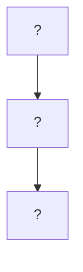
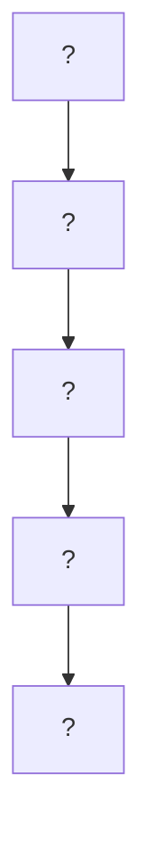

# Exercices sur les Chaînes Fonctionnelles

> **Source** : Adapté de [Techno-Logique](https://www.techno-logique.com/AUT-chaines-fonctionnelles.shtml)
> **Niveau** : Débutant à Intermédiaire
> **Durée estimée** : 1 à 2 heures

---

## 📌 **Table des Matières**
1. [Exercices sur la Chaîne d'Information](#-exercices-sur-la-chaîne-dinformation)
2. [Exercices sur la Chaîne d'Énergie](#-exercices-sur-la-chaîne-dénergie)
3. [Exercices d'Intégration](#-exercices-dintégration)
4. [Corrigés](#-corrigés)
5. [Évaluations](#-évaluations)

---

---

## 🔹 **1. Exercices sur la Chaîne d'Information**

### **📝 Exercice 1.1 : Identifier les Fonctions de la Chaîne d'Information**
**Consigne** : Pour chaque système décrit ci-dessous, identifiez les **3 fonctions** de la chaîne d'information (Acquérir, Traiter, Communiquer) et donnez un exemple de **solution technologique** pour chaque fonction.

| **Système**               | **Acquérir** (Capteur) | **Traiter** (Unité)       | **Communiquer** (Support) |
|---------------------------|------------------------|---------------------------|---------------------------|
| Alarme incendie           |                        |                           |                           |
| Éclairage automatique     |                        |                           |                           |
| Thermostat connecté       |                        |                           |                           |
| Porte de garage automatique |                    |                           |                           |

---

### **📝 Exercice 1.2 : Schématiser une Chaîne d'Information**
**Consigne** : Dessinez le **schéma fonctionnel** de la chaîne d'information pour un **système de détection de présence** (ex. lumière qui s'allume quand quelqu'un entre dans une pièce).

**Étapes** :
1. Identifiez les **grandeurs physiques** à détecter.
2. Choisissez un **capteur** adapté.
3. Décrivez l'**unité de traitement** (ex. microcontrôleur).
4. Indiquez comment les **ordres** sont communiqués (ex. fil électrique, sans fil).

**Schéma à compléter** (utilisez [Mermaid](https://mermaid.live/) ou dessinez à la main) :


---

### **📝 Exercice 1.3 : Choisir le Bon Capteur**
**Consigne** : Pour chaque **grandeur physique** à mesurer, sélectionnez le **capteur le plus adapté** parmi les propositions.

| **Grandeur à Mesurer** | **Capteur Proposé 1** | **Capteur Proposé 2** | **Capteur Proposé 3** | **Votre Choix** |
|------------------------|------------------------|------------------------|------------------------|-----------------|
| Température            | Cellule photoélectrique | Thermistance          | Détecteur de mouvement |                 |
| Présence d'une personne | Bouton-poussoir       | Détecteur infrarouge  | Thermostat            |                 |
| Niveau de lumière      | Anémomètre            | Photoresistance       | Microphone            |                 |
| Vitesse du vent        | Anémomètre            | Thermistance          | Cellule photoélectrique |                 |

---

### **📝 Exercice 1.4 : Étude de Cas - Système de Sécurité**
**Contexte** : Un système de sécurité pour une maison comprend :
- Un **détecteur de mouvement** (capteur PIR).
- Une **centrale d'alarme** (microcontrôleur).
- Une **sirène** et des **voyants lumineux** (effecteurs).

**Questions** :
1. Quelle est la **fonction principale** de la chaîne d'information dans ce système ?
2. Identifiez les **3 blocs fonctionnels** de la chaîne d'information.
3. Proposez un **schéma fonctionnel** simple.
4. Quels **signaux** sont échangés entre la chaîne d'information et la chaîne d'énergie ?

---

---

## 🔹 **2. Exercices sur la Chaîne d'Énergie**

### **📝 Exercice 2.1 : Identifier les Fonctions de la Chaîne d'Énergie**
**Consigne** : Pour chaque système, identifiez les **4 fonctions** de la chaîne d'énergie (Alimenter, Distribuer, Convertir, Transmettre) et donnez un exemple de **solution technologique** pour chaque fonction.

| **Système**               | **Alimenter**       | **Distribuer**       | **Convertir**        | **Transmettre**     |
|---------------------------|--------------------|----------------------|----------------------|----------------------|
| Store automatique          |                    |                      |                      |                      |
| Robot aspirateur           |                    |                      |                      |                      |
| Porte automatique de supermarché |              |                      |                      |                      |
| Ascenseur                  |                    |                      |                      |                      |

---

### **📝 Exercice 2.2 : Schématiser une Chaîne d'Énergie**
**Consigne** : Dessinez le **schéma fonctionnel** de la chaîne d'énergie pour un **système de levage** (ex. monte-charge).

**Étapes** :
1. Identifiez la **source d'énergie** (ex. électricité, hydraulique).
2. Décrivez comment l'énergie est **alimentée** et **distribuée**.
3. Choisissez un **actionneur** (ex. moteur, vérin).
4. Indiquez comment l'énergie est **transmise** à l'effecteur (ex. poulies, engrenages).

**Schéma à compléter** :


---

### **📝 Exercice 2.3 : Choisir le Bon Actionneur**
**Consigne** : Pour chaque **action à réaliser**, sélectionnez l'**actionneur le plus adapté**.

| **Action à Réaliser**       | **Actionneur Proposé 1** | **Actionneur Proposé 2** | **Actionneur Proposé 3** | **Votre Choix** |
|----------------------------|--------------------------|--------------------------|--------------------------|-----------------|
| Faire tourner un ventilateur | Moteur électrique       | Vérin pneumatique        | Résistance chauffante    |                 |
| Soulever une charge lourde  | Moteur électrique       | Vérin hydraulique        | Électroaimant            |                 |
| Verrouiller une porte       | Moteur électrique       | Électroaimant            | Haut-parleur             |                 |
| Chauffer une pièce          | Moteur électrique       | Résistance chauffante    | Vérin pneumatique        |                 |

---

### **📝 Exercice 2.4 : Étude de Cas - Porte de Garage Automatique**
**Contexte** : Une porte de garage automatique fonctionne comme suit :
1. Un **moteur électrique** soulève ou abaisse la porte.
2. Un **système d'engrenages** réduit la vitesse du moteur.
3. Un **boîtier d'alimentation** fournit le courant nécessaire.
4. Un **relais** contrôle l'alimentation du moteur.

**Questions** :
1. Identifiez les **4 fonctions** de la chaîne d'énergie.
2. Associez chaque fonction à un **composant** du système.
3. Dessinez le **schéma fonctionnel** de la chaîne d'énergie.
4. Quelle est la **source d'énergie** principale ?

---

---

## 🔹 **3. Exercices d'Intégration**

### **📝 Exercice 3.1 : Système Complet - Chauffage Central**
**Contexte** : Un système de chauffage central comprend :
- **Chaîne d'information** :
  - Thermostat (capteur de température).
  - Circuit intégré (comparaison température réelle/consigne).
  - Carte électronique (envoi des ordres).
- **Chaîne d'énergie** :
  - Alimentation électrique (220V).
  - Relais (distribution).
  - Chaudière (conversion énergie électrique → thermique).
  - Radiateurs (transmission de la chaleur).

**Questions** :
1. Dessinez le **schéma global** du système (chaîne d'information + chaîne d'énergie).
2. Expliquez le **fonctionnement en boucle fermée**.
3. Que se passe-t-il si la température réelle **dépasse** la consigne ?
4. Proposez une **amélioration** pour rendre le système plus efficace.

---

### **📝 Exercice 3.2 : Système Complet - Store Automatique**
**Contexte** : Un store automatique est commandé par une télécommande. Il comprend :
- **Chaîne d'information** :
  - Bouton de la télécommande (consigne).
  - Récepteur infrarouge (acquisition).
  - Microcontrôleur (traitement).
- **Chaîne d'énergie** :
  - Boîtier d'alimentation (24V).
  - Contacteurs (distribution).
  - Moteur électrique (conversion).
  - Engrenages (transmission).

**Questions** :
1. Dessinez le **schéma fonctionnel complet** (chaîne d'information + chaîne d'énergie).
2. Que se passe-t-il quand on appuie sur le bouton "monter" de la télécommande ?
3. Pourquoi utilise-t-on des **engrenages** dans ce système ?
4. Proposez une **solution alternative** pour la transmission de l'énergie.

---

### **📝 Exercice 3.3 : Conception d'un Système - Alarme de Piscine**
**Consigne** : Concevez un **système d'alarme pour piscine** qui se déclenche quand un enfant tombe dans l'eau. Le système doit comprendre :
1. Une **chaîne d'information** pour détecter la chute.
2. Une **chaîne d'énergie** pour activer l'alarme (sirène + voyants).

**Étapes** :
1. **Définissez les grandeurs à détecter** (ex. mouvement dans l'eau).
2. **Choisissez les capteurs** adaptés.
3. **Décrivez l'unité de traitement** (ex. microcontrôleur, automate).
4. **Concevez la chaîne d'énergie** :
   - Source d'énergie.
   - Actionneur(s).
   - Effecteur(s).
5. **Dessinez le schéma fonctionnel complet**.

---

### **📝 Exercice 3.4 : Analyse d'un Système Existant - Robot Aspirateur**
**Consigne** : Analysez le fonctionnement d'un **robot aspirateur** (ex. Roomba) en identifiant :
1. Les **capteurs** utilisés (chaîne d'information).
2. L'**unité de traitement** (ex. microprocesseur).
3. Les **actionneurs** et **effecteurs** (chaîne d'énergie).
4. Les **interactions** entre les deux chaînes.

**Questions supplémentaires** :
- Comment le robot **évite-t-il les obstacles** ?
- Comment **nettoie-t-il** le sol ?
- Proposez une **amélioration** pour ce système.

---

---

## 🔹 **4. Corrigés**

> ⚠️ **À ne consulter qu'après avoir tenté les exercices !**

### **📌 Corrigé 1.1 : Identifier les Fonctions de la Chaîne d'Information**

| **Système**               | **Acquérir** (Capteur)       | **Traiter** (Unité)       | **Communiquer** (Support)  |
|---------------------------|-----------------------------|---------------------------|----------------------------|
| Alarme incendie           | Détecteur de fumée          | Microcontrôleur           | Fil électrique / sans fil  |
| Éclairage automatique     | Cellule photoélectrique     | Automate programmable     | Réseau électrique          |
| Thermostat connecté       | Thermistance               | Circuit intégré           | Wi-Fi / Bluetooth          |
| Porte de garage automatique | Détecteur de mouvement    | Microcontrôleur           | Ondes radio                |

---

### **📌 Corrigé 1.2 : Schématiser une Chaîne d'Information (Détection de Présence)**

**Schéma** :
```mermaid
graph TD
    A[Cellule photoélectrique
    (Acquérir)] --> B[Microcontrôleur
    (Traiter)]
    B --> C[Relais
    (Communiquer)]
    C --> D[Lampe
    (Effecteur)]
    
    style A fill:#f9f
    style B fill:#bbf
    style C fill:#f96
```

**Explications** :
1. **Acquérir** : La cellule photoélectrique détecte la présence d'une personne.
2. **Traiter** : Le microcontrôleur analyse le signal et décide d'allumer la lampe.
3. **Communiquer** : Le relais envoie l'ordre à la lampe.

---

### **📌 Corrigé 1.3 : Choisir le Bon Capteur**

| **Grandeur à Mesurer** | **Votre Choix**          |
|------------------------|--------------------------|
| Température            | Thermistance            |
| Présence d'une personne | Détecteur infrarouge   |
| Niveau de lumière      | Photoresistance         |
| Vitesse du vent        | Anémomètre              |

---

### **📌 Corrigé 1.4 : Étude de Cas - Système de Sécurité**

**Réponses** :
1. **Fonction principale** : Détecter une intrusion et déclencher une alarme.
2. **3 blocs fonctionnels** :
   - **Acquérir** : Détecteur de mouvement (PIR).
   - **Traiter** : Centrale d'alarme (microcontrôleur).
   - **Communiquer** : Fils électriques ou sans fil vers la sirène.
3. **Schéma fonctionnel** :
   ```mermaid
   graph TD
       A[Détecteur PIR
       (Acquérir)] --> B[Centrale d'alarme
       (Traiter)]
       B --> C[Sirène/Voyants
       (Communiquer)]
   ```
4. **Signaux échangés** :
   - **Chaîne d'information → Chaîne d'énergie** : Ordre "activer la sirène".
   - **Chaîne d'énergie → Chaîne d'information** : Confirmation de l'activation (optionnel).

---

### **📌 Corrigé 2.1 : Identifier les Fonctions de la Chaîne d'Énergie**

| **Système**               | **Alimenter**       | **Distribuer**       | **Convertir**        | **Transmettre**     |
|---------------------------|--------------------|----------------------|----------------------|----------------------|
| Store automatique          | Boîtier d'alimentation (24V) | Contacteurs | Moteur électrique | Engrenages |
| Robot aspirateur           | Batterie (18V)     | Circuit imprimé     | Moteurs DC          | Roues + courroies    |
| Porte automatique de supermarché | Alimentation secteur | Relais | Moteur électrique | Bielle + bras |
| Ascenseur                  | Alimentation 380V  | Variateur de vitesse | Moteur asynchrone | Poulie + câbles |

---

### **📌 Corrigé 2.2 : Schématiser une Chaîne d'Énergie (Système de Levage)**

**Schéma** :
```mermaid
graph TD
    A[Alimentation électrique
    (Alimenter)] --> B[Relais
    (Distribuer)]
    B --> C[Moteur électrique
    (Convertir)]
    C --> D[Poulie + Câble
    (Transmettre)]
    D --> E[Crochet de levage
    (Effecteur)]
    
    style A fill:#ff9
    style B fill:#ff6
    style C fill:#9cf
    style D fill:#9f9
```

**Explications** :
1. **Alimenter** : L'alimentation fournit le courant au système.
2. **Distribuer** : Le relais contrôle l'alimentation du moteur.
3. **Convertir** : Le moteur transforme l'énergie électrique en mouvement rotatif.
4. **Transmettre** : La poulie et le câble transforment le mouvement rotatif en mouvement linéaire.

---

### **📌 Corrigé 2.3 : Choisir le Bon Actionneur**

| **Action à Réaliser**       | **Votre Choix**          |
|----------------------------|--------------------------|
| Faire tourner un ventilateur | Moteur électrique       |
| Soulever une charge lourde  | Vérin hydraulique        |
| Verrouiller une porte       | Électroaimant            |
| Chauffer une pièce          | Résistance chauffante    |

---

### **📌 Corrigé 2.4 : Étude de Cas - Porte de Garage Automatique**

**Réponses** :
1. **4 fonctions** : Alimenter, Distribuer, Convertir, Transmettre.
2. **Composants** :
   - **Alimenter** : Boîtier d'alimentation.
   - **Distribuer** : Relais.
   - **Convertir** : Moteur électrique.
   - **Transmettre** : Système d'engrenages.
3. **Schéma fonctionnel** :
   ```mermaid
   graph TD
       A[Boîtier d'alimentation
       (Alimenter)] --> B[Relais
       (Distribuer)]
       B --> C[Moteur électrique
       (Convertir)]
       C --> D[Engrenages
       (Transmettre)]
       D --> E[Porte
       (Effecteur)]
   ```
4. **Source d'énergie** : Électricité (220V ou 24V selon le système).

---

### **📌 Corrigé 3.1 : Système Complet - Chauffage Central**

**Réponses** :
1. **Schéma global** :
   ```mermaid
   graph LR
       subgraph Chaîne d'Information
           A[Thermostat
           (Acquérir)] --> B[Circuit intégré
           (Traiter)]
           B --> C[Carte électronique
           (Communiquer)]
       end
       
       subgraph Chaîne d'Énergie
           D[Alimentation 220V
           (Alimenter)] --> E[Relais
           (Distribuer)]
           E --> F[Chaudière
           (Convertir)]
           F --> G[Radiateurs
           (Transmettre)]
       end
       
       C --> E
       G --> A
   ```
2. **Fonctionnement en boucle fermée** :
   - Le thermostat mesure la température → Le circuit intégré compare à la consigne → La carte électronique envoie un ordre au relais → Le relais active la chaudière → Les radiateurs chauffent → La température monte → Le thermostat mesure à nouveau.
3. **Si température > consigne** : Le circuit intégré envoie un ordre pour **éteindre la chaudière**.
4. **Amélioration** : Ajouter un **thermostat programmable** pour optimiser la consommation d'énergie.

---

### **📌 Corrigé 3.2 : Système Complet - Store Automatique**

**Réponses** :
1. **Schéma fonctionnel complet** :
   ```mermaid
   graph LR
       subgraph Chaîne d'Information
           A[Bouton télécommande
           (Consigne)] --> B[Récepteur IR
           (Acquérir)]
           B --> C[Microcontrôleur
           (Traiter)]
           C --> D[Contacteurs
           (Communiquer)]
       end
       
       subgraph Chaîne d'Énergie
           E[Boîtier 24V
           (Alimenter)] --> F[Contacteurs
           (Distribuer)]
           F --> G[Moteur
           (Convertir)]
           G --> H[Engrenages
           (Transmettre)]
           H --> I[Tube d'enroulement
           (Effecteur)]
       end
       
       D --> F
   ```
2. **Appui sur "monter"** :
   - Le bouton envoie un signal IR → Le récepteur l'acquiert → Le microcontrôleur traite l'ordre → Les contacteurs distribuent le courant au moteur → Le moteur tourne → Les engrenages réduisent la vitesse → Le tube enroule la toile → Le store monte.
3. **Rôle des engrenages** : Réduire la vitesse de rotation du moteur et **augmenter le couple** pour soulever le store.
4. **Solution alternative** : Utiliser une **courroie et des poulies** au lieu des engrenages.

---

### **📌 Corrigé 3.3 : Conception d'un Système - Alarme de Piscine**

**Proposition de solution** :
1. **Grandeurs à détecter** : Mouvement dans l'eau (vagues, chute).
2. **Capteurs** :
   - **Capteur de mouvement** (détecteur de vagues).
   - **Capteur de pression** (détection d'un impact dans l'eau).
3. **Unité de traitement** : Microcontrôleur (ex. Arduino) avec un programme qui analyse les signaux des capteurs.
4. **Chaîne d'énergie** :
   - **Alimenter** : Batterie 12V + panneau solaire.
   - **Distribuer** : Relais.
   - **Convertir** : Sirène (énergie électrique → sonore) + voyants LED (énergie électrique → lumière).
   - **Transmettre** : Fils électriques (ou sans fil).
5. **Schéma fonctionnel** :
   ```mermaid
   graph TD
       A[Capteur de mouvement
       (Acquérir)] --> B[Microcontrôleur
       (Traiter)]
       B --> C[Relais
       (Communiquer)]
       C --> D[Batterie
       (Alimenter)]
       D --> E[Relais
       (Distribuer)]
       E --> F[Sirène
       (Convertir)]
       E --> G[Voyants LED
       (Convertir)]
   ```

---

### **📌 Corrigé 3.4 : Analyse d'un Système Existant - Robot Aspirateur**

**Réponses** :
1. **Capteurs** :
   - Détecteurs de collision (pour éviter les obstacles).
   - Capteurs infrarouges (pour détecter les bords).
   - Capteurs de poussière (pour adapter l'aspiration).
2. **Unité de traitement** : Microprocesseur (ex. Raspberry Pi ou puce dédiée).
3. **Actionneurs et effecteurs** :
   - **Actionneurs** : Moteurs (pour les roues et la brosse), ventilateur (pour l'aspiration).
   - **Effecteurs** : Roues (déplacement), brosse (nettoyage), sac à poussière (stockage).
4. **Interactions** :
   - Les capteurs envoient des données au microprocesseur → Le microprocesseur envoie des ordres aux moteurs → Les moteurs agissent sur les roues et la brosse.

**Réponses aux questions supplémentaires** :
- **Éviter les obstacles** : Grâce aux **détecteurs de collision** et **capteurs infrarouges**, le robot change de direction.
- **Nettoyer le sol** : La **brosse** et le **ventilateur** aspirent la poussière dans le sac.
- **Amélioration** : Ajouter un **capteur de cartographie** (ex. LiDAR) pour un nettoyage plus méthodique.

---

---

## 🔹 **5. Évaluations**

### **📝 Évaluation 1 : QCM sur les Chaînes Fonctionnelles**
**Consigne** : Répondez aux questions suivantes en cochant la bonne réponse.

1. **Quelle est la fonction principale de la chaîne d'information ?**
   - [ ] Alimenter le système en énergie.
   - [x] Prendre des décisions en fonction des données.
   - [ ] Convertir l'énergie en mouvement.

2. **Quel composant fait partie de la chaîne d'énergie ?**
   - [ ] Thermostat.
   - [ ] Microcontrôleur.
   - [x] Moteur électrique.

3. **Quel capteur est utilisé pour mesurer la température ?**
   - [ ] Cellule photoélectrique.
   - [x] Thermistance.
   - [ ] Détecteur de mouvement.

4. **Quel actionneur transforme l'énergie électrique en mouvement rotatif ?**
   - [x] Moteur électrique.
   - [ ] Vérin pneumatique.
   - [ ] Résistance chauffante.

5. **Dans une boucle fermée, que fait le système avec la sortie ?**
   - [ ] Il l'ignore.
   - [x] Il l'utilise comme entrée pour ajuster son fonctionnement.
   - [ ] Il l'affiche à l'utilisateur.

---

### **📝 Évaluation 2 : Étude de Cas - Système de Climatisation**
**Consigne** : Analysez le système de climatisation décrit ci-dessous et répondez aux questions.

**Description du système** :
- Un **thermostat** mesure la température de la pièce.
- Un **microcontrôleur** compare la température mesurée à la consigne (22°C).
- Si la température est trop élevée, le microcontrôleur active un **relais**.
- Le relais alimente un **compresseur** (actionneur).
- Le compresseur refroidit l'air, qui est ensuite distribué par des **ventilateurs**.

**Questions** :
1. Dessinez le **schéma fonctionnel complet** (chaîne d'information + chaîne d'énergie).
2. Identifiez les **4 fonctions de la chaîne d'énergie** et associez-les aux composants.
3. Que se passe-t-il si la température descend en dessous de 22°C ?
4. Proposez une **amélioration** pour réduire la consommation d'énergie.

---

### **📝 Évaluation 3 : Conception d'un Système - Arrosage Automatique**
**Consigne** : Concevez un **système d'arrosage automatique** pour un jardin. Le système doit :
- Arroser les plantes **tous les matins à 7h**.
- **Arrêter l'arrosage** si le sol est déjà humide.
- Utiliser une **pompe à eau** pour distribuer l'eau.

**Étapes** :
1. **Définissez les grandeurs à détecter** (ex. heure, humidité du sol).
2. **Choisissez les capteurs** adaptés.
3. **Décrivez l'unité de traitement** (ex. minuteur, microcontrôleur).
4. **Concevez la chaîne d'énergie** :
   - Source d'énergie.
   - Actionneur(s).
   - Effecteur(s).
5. **Dessinez le schéma fonctionnel complet**.

---

---

## 📌 **Barème et Conseils**

### **Barème pour les Évaluations**
| **Critère**               | **Points** |
|---------------------------|------------|
| Exactitude des réponses   | 50%        |
| Clarté des schémas        | 20%        |
| Pertinence des explications | 20%      |
| Originalité des améliorations | 10%   |

### **Conseils pour Réussir**
1. **Lisez attentivement** les consignes avant de commencer.
2. **Dessinez des schémas** pour visualiser les systèmes.
3. **Vérifiez vos réponses** avec les corrigés après avoir terminé.
4. **Pratiquez régulièrement** avec des exemples concrets.
5. **Utilisez des outils** comme [Mermaid](https://mermaid.live/) pour créer des schémas.

---

**© 2026 - Adapté de [Techno-Logique](https://www.techno-logique.com/AUT-chaines-fonctionnelles.shtml)**
